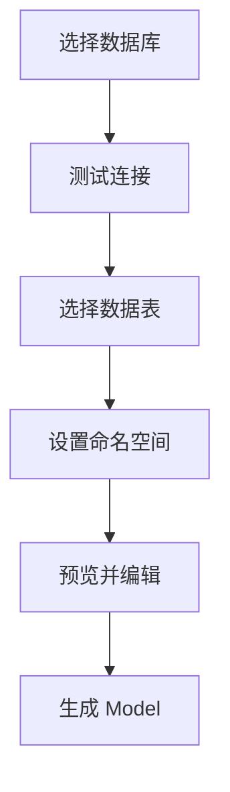
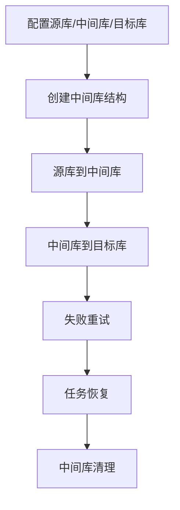

# FastData 项目文档

更新时间：2026-05-24

---

## 目录

1. [项目概述](#项目概述)
2. [需求文档](#需求文档)
3. [技术方案](#技术方案)
4. [实施任务清单](#实施任务清单)
5. [使用指南](#使用指南)
6. [当前进度](#当前进度)

---

## 项目概述

FastData 是一个面向 .NET Framework 的轻量 ORM 组件，支持 Lambda 查询、XML Map SQL、Code First、Db First、AOP、缓存、Redis 辅助能力和多数据库连接配置。

**支持的数据库**
- Oracle、MySQL、SQL Server、SQLite、PostgreSQL、DB2

**核心能力**
- 支持默认数据库连接和按 Key 指定数据库连接
- 支持 `FastRead`、`FastWrite` 静态入口
- 支持 `FastRead.Use(key)`、`FastWrite.Use(key)` 绑定数据库 Key
- 支持 `using (FastDb.Use(key))` 在当前执行上下文中切换数据库
- 支持 `FastRepository` 和 `FastRepositoryFactory`
- 支持 XML Map SQL、动态 SQL 标签和 AOP 扩展

**NuGet**
- <https://www.nuget.org/packages/Fast.Data/>

---

## 需求文档

### 1. 原始需求

1. 继续完善功能，对架构进行优化，对重复代码进行抽取，减少包体积，提高扩展性、健壮性、可用性。
2. 制作生成 Model 工具。
3. 多数据库支持下简化配置。
4. 生成中文使用文档。
5. 使用这个 ORM 框架制作数据同步工具。

### 2. 功能需求

#### 2.1 架构优化

系统应抽取数据库差异处理逻辑，减少 Oracle、MySQL、SQL Server 等数据库在配置解析、SQL 方言、参数占位符、分页、字段包装和元数据读取上的重复代码。

系统应将工具能力与 ORM 核心能力分离，Model 生成工具和数据同步工具独立成项目，避免增加 ORM 核心包体积。

系统应通过数据库适配器、SQL 方言接口、元数据读取接口和配置工厂提升扩展性。

系统应保持现有公开 API 可用，同时提供更优雅的多数据库切换写法。

#### 2.2 Model 生成工具

Model 生成工具应使用 WinForms 实现。

工具应支持选择数据库类型、填写连接信息、测试连接、选择数据表、批量选择表、指定命名空间、预览并编辑生成代码、输出 Model 文件。

工具应支持默认命名空间和单表命名空间覆盖。

工具应通过统一元数据读取接口支持 SQL Server、MySQL、Oracle，并预留其他数据库扩展点。

#### 2.3 多数据库配置简化

系统应提供统一数据库连接配置结构，减少按数据库类型分组的重复 XML 配置。

系统应支持默认数据库配置，常用场景可以省略数据库 Key。

系统应支持通过更直观的 API 在多个数据库之间切换，例如默认库、指定库、作用域切换和 Repository 注入。

系统应保留现有配置格式的兼容读取能力。

#### 2.4 中文使用文档

系统应提供中文文档，覆盖快速开始、多数据库配置、优雅切换数据库写法、Code First、Db First、XML SQL Map、Repository、AOP、Model 生成工具、数据同步工具和常见问题。

#### 2.5 数据同步工具

数据同步工具应使用 WinForms 实现，并复用 FastData ORM 能力。

工具应支持选择源数据库、中间库和目标数据库。

工具应支持创建中间库结构，并支持导出创建中间库的 SQL 脚本，用于自动创建失败后的手动处理。

同步流程应采用中间库模式：源库数据先写入中间库，再由中间库按策略同步到目标库。

同步策略应支持全量同步、增量同步、定时同步、重试、失败记录和冲突处理。

中间库数据应支持自动清理，避免数据长期积压导致库体积过大。

工具应关注实时性和稳定性，支持短间隔轮询、批量处理、任务恢复、错误日志和运行状态查看。

### 3. 验收标准

1. ORM 核心重复数据库分支减少，新增数据库具备清晰扩展路径。
2. ORM 核心包不引入 WinForms 工具依赖。
3. Model 生成工具可以连接数据库，选择多张表，指定命名空间，预览编辑并生成可编译 Model。
4. 多数据库配置可以使用统一结构，并支持默认库和指定库的优雅切换写法。
5. 中文文档覆盖 ORM 核心能力和两个工具的使用流程。
6. 数据同步工具可以完成源库到中间库、中间库到目标库的同步。
7. 数据同步工具可以导出中间库建库 SQL。
8. 数据同步工具具备重试、恢复、日志和中间库清理能力。

---

## 技术方案

### 1. 总体架构

新增三个项目，保持 ORM 核心轻量：

1. `FastData.Tooling`：工具公共库，提供数据库适配、元数据读取、类型映射、脚本生成和日志能力。
2. `FastData.ModelGenerator.WinForms`：Model 生成工具。
3. `FastData.SyncTool.WinForms`：数据同步工具。

核心库 `FastData` 继续负责 ORM 运行时能力，工具项目引用核心库，核心库不引用工具项目。

### 2. 架构优化

#### 2.1 抽象接口

```csharp
public interface IDatabaseAdapter
{
    string DbType { get; }
    string ProviderName { get; }
    ISqlDialect Dialect { get; }
}

public interface ISqlDialect
{
    string ApplyTake(string sql, int take);
    string BuildParameterName(string name);
}

public interface IDatabaseMetadataReader
{
    IList<DatabaseTable> GetTables();
    IList<DatabaseColumn> GetColumns(string tableName);
}
```

#### 2.2 迁移顺序

1. 配置解析
2. SQL 方言
3. 元数据读取
4. 日志与 Map 文件持久化

### 3. 多数据库配置与优雅切换

#### 3.1 简化配置

新增统一 `Connections` 配置，保留旧格式兼容读取。

```xml
<DataConfig Default="DefaultDb">
  <Connections>
    <Add Key="DefaultDb" Provider="SqlServer" ConnStr="..." DesignModel="DbFirst" />
    <Add Key="ReportDb" Provider="MySql" ConnStr="..." DesignModel="DbFirst" />
  </Connections>
</DataConfig>
```

#### 3.2 推荐 API 写法

**默认库读取**
```csharp
var users = FastRead.Query<User>(a => a.IsEnabled == true);
```

**指定库读取**
```csharp
var reports = FastRead.Use("ReportDb").Query<Report>(a => a.Year == 2026);
```

**作用域切换**
```csharp
using (FastDb.Use("ArchiveDb"))
{
    var logs = FastRead.Query<Log>(a => a.CreatedTime >= beginTime);
    FastWrite.Add(new ArchiveLog());
}
```

**Repository 注入**
```csharp
public class UserService
{
    private readonly IFastRepository defaultRepository;
    private readonly IFastRepository reportRepository;

    public UserService(IFastRepositoryFactory factory)
    {
        defaultRepository = factory.Default();
        reportRepository = factory.Use("ReportDb");
    }
}
```

### 4. Model 生成工具方案



### 5. 数据同步工具方案



---

## 实施任务清单

### 1. 架构优化

- [x] 梳理现有多数据库重复代码。
- [x] 抽取数据库适配器接口。
- [x] 抽取 SQL 方言接口。
- [x] 抽取元数据读取接口。
- [x] 将工具项目与 ORM 核心项目分离。

### 2. 多数据库配置简化

- [x] 新增统一 `Connections` 配置结构。
- [x] 保留旧配置格式兼容读取。
- [x] 实现默认数据库配置。
- [x] 实现 `FastRead.Use(key)` 和 `FastWrite.Use(key)`。
- [x] 实现 `FastDb.Use(key)` 作用域切换。
- [x] 实现 `IFastRepositoryFactory` 指定库 Repository。
- [x] 补充配置错误提示和可用 Key 提示。

### 3. Model 生成工具

- [x] 新建 `FastData.Tooling` 公共工具项目。
- [x] 新建 `FastData.ModelGenerator.WinForms` 项目。
- [x] 实现数据库连接测试。
- [x] 实现表加载、多选和代码预览。
- [x] 实现默认命名空间配置。
- [x] 实现表搜索过滤。
- [x] 实现字段预览。
- [x] 实现单表命名空间覆盖。
- [x] 实现 Model 代码预览、编辑和生成。
- [x] 验证生成工具项目可编译。

### 4. 数据同步工具

- [x] 新建 `FastData.SyncTool.WinForms` 项目。
- [x] 实现源库和目标库配置。
- [x] 设计中间库表结构。
- [x] 实现 SQL Server、MySQL、Oracle 中间库脚本生成。
- [x] 实现中间库 SQL 导出。
- [x] 实现基础全量同步。
- [x] 实现增量同步基础入口。
- [x] 实现同步重试和错误计数。
- [x] 实现失败记录保存与恢复。
- [x] 实现中间库历史数据清理。
- [x] 实现自动创建中间库表。
- [x] 实现任务状态和错误日志界面。

### 5. 中文文档

- [x] 编写快速开始文档。
- [x] 编写多数据库配置和优雅切换文档。
- [x] 编写 Model 生成工具文档。
- [x] 编写数据同步工具文档。
- [x] 编写 XML SQL Map、Repository、AOP 和 FAQ 文档。

### 6. 代码实现完成状态

- [x] 构建通过，`0 Warning(s)`、`0 Error(s)`。
- [x] 修复过期 API。
- [x] 新增数据库适配器抽象。
- [x] 新增 SQL 方言抽象。

---

## 使用指南

### 快速安装

```powershell
Install-Package Fast.Data
```

```bash
dotnet add package Fast.Data
```

### 快速配置

```xml
<configSections>
  <section name="DataConfig" type="FastData.Config.DataConfig,FastData" />
</configSections>

<DataConfig Default="DefaultDb">
  <Connections>
    <Add Provider="SqlServer" Key="DefaultDb" ConnStr="server=.;database=demo;uid=sa;pwd=123456" IsDefault="true" DesignModel="DbFirst" CacheType="web" />
    <Add Provider="MySql" Key="ReportDb" ConnStr="server=127.0.0.1;database=report;uid=root;pwd=123456" DesignModel="DbFirst" CacheType="web" />
  </Connections>
</DataConfig>
```

### 快速使用

默认库查询：
```csharp
var users = FastRead.Query<User>(a => a.IsEnabled == true);
```

指定库查询：
```csharp
var reports = FastRead.Use("ReportDb").Query<Report>(a => a.Year == 2026);
```

作用域切换：
```csharp
using (FastDb.Use("ArchiveDb"))
{
    var logs = FastRead.Query<Log>(a => a.CreatedTime >= beginTime);
    FastWrite.Add(new ArchiveLog());
}
```

Repository 工厂：
```csharp
services.AddTransient<IFastRepositoryFactory, FastRepositoryFactory>();

var defaultRepository = factory.Default();
var reportRepository = factory.Use("ReportDb");
```

### 详细文档

完整使用说明请参阅：[usage.md](./usage.md)

---

## 当前进度

### 已完成

- 已创建 2026 年 5 月需求、技术方案和实施任务清单。
- 已实现统一 `Connections` 多数据库配置结构。
- 已保留旧版按数据库类型分组配置的兼容读取能力。
- 已实现默认数据库配置，未传 Key 时可使用默认库。
- 已实现 `FastRead.Use(key)` 和 `FastWrite.Use(key)` 绑定数据库 Key 调用入口。
- 已实现 `FastDb.Use(key)` 作用域数据库切换。
- 已实现 `IFastRepositoryFactory` 和 `FastRepositoryFactory`，支持默认库与指定库 Repository。
- 已补充配置 Key 缺失时的可甤 Key 错误提示。
- 已修复当前构建中暴露的 SQL Server MapFile 模型重复定义问题。
- 已修复 `VisitModel.IsSuccess` 缺失问题。
- 已修复 `DataContext` 中 `Parameter.ParamMerge(...)` 命名空间引用问题。
- 已将中文使用说明整理到 `.monkeycode/docs/usage.md`。
- 已将 README 收敛为项目入口、快速示例和文档导航。
- 已新增 `FastData.Tooling` 公共工具库，包含元数据读取、Model 代码生成、中间库 SQL 生成和基础同步服务。
- 已新增 `FastData.ModelGenerator.WinForms`，支持连接测试、加载数据表、表搜索、字段预览、单表命名空间覆盖、预览代码和生成 Model 文件。
- 已新增 `FastData.SyncTool.WinForms`，支持源库/目标库配置、中间库配置、SQL Server/MySQL/Oracle 中间库 SQL 导出、自动创建中间库表、基础全量同步、基础增量同步、失败重试计数、失败记录恢复、中间库清理入口和运行日志。
- 已补充 XML SQL Map、Repository、AOP 和 FAQ 文档。
- 已在核心包中新增数据库适配器和 SQL 方言抽象骨架，包含 `IDatabaseAdapter`、`ISqlDialect` 和 `DatabaseAdapterFactory`。
- 已替换 `BaseCodeDom` 中过期的 `CreateCompiler()` API，使用 `CSharpCodeProvider.CompileAssemblyFromSource`。

### 验证状态

最近一次构建命令：

```bash
DOTNET_SYSTEM_GLOBALIZATION_INVARIANT=1 FrameworkPathOverride="/root/.nuget/packages/microsoft.netframework.referenceassemblies.net45/1.0.3/build/.NETFramework/v4.5" /root/.dotnet/dotnet build FastData.sln /p:RegisterForComInterop=false
```

验证结果：
- 构建通过，`0 Warning(s)`、`0 Error(s)`。

### 待环境验证（需真实数据库）

以下验证项代码已实现，但需要在具备真实数据库连接的环境中执行验证：

**ORM 核心验证**
- [ ] 验证原有 ORM API 兼容（`FastRead.Query`、`FastWrite.Add` 等）。
- [ ] 验证默认库和指定库切换写法。
- [ ] 验证多数据库同时使用场景。

**数据同步验证**
- [ ] 验证源库到目标库端到端同步。
- [ ] 验证失败重试机制。
- [ ] 验证任务恢复（从中间库恢复失败记录）。
- [ ] 验证中间库清理。
- [ ] 验证增量同步。

**Model 生成工具验证**
- [ ] 使用真实数据库连接测试连接。
- [ ] 加载真实数据表。
- [ ] 生成 Model 并编译验证。

### 构建命令

```bash
# .NET Framework 4.5 构建（Linux 环境）
DOTNET_SYSTEM_GLOBALIZATION_INVARIANT=1 \
FrameworkPathOverride="/root/.nuget/packages/microsoft.netframework.referenceassemblies.net45/1.0.3/build/.NETFramework/v4.5" \
/root/.dotnet/dotnet build FastData.sln /p:RegisterForComInterop=false
```

### 已知注意事项

- `dotnet-install.sh` 为本地未跟踪文件，已排除在提交之外。
- Linux 环境构建需设置 `FrameworkPathOverride`。
- 使用 `/p:RegisterForComInterop=false` 绕过 COM 注册限制。

### 最近提交

- `b94c3e9` chore: update task status to reflect code implementation complete
- `c6fa631` docs: update README build status
- `e39fbcc` docs: finalize May 2026 progress summary
- `b83e03a` chore: fix deprecated API and update progress
- `85845b2` refactor: add database adapter abstractions
- `52e99c9` feat: add sync recovery workflow
- `8b4216a` feat: enhance tooling workflows
- `638d865` feat: add model generator and sync tools

---

**当前状态**：所有代码实现已完成，构建 `0 Warning(s)`, `0 Error(s)`。剩余验证项需在真实数据库环境中执行。
