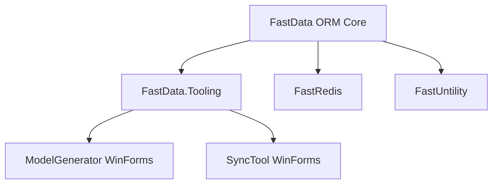
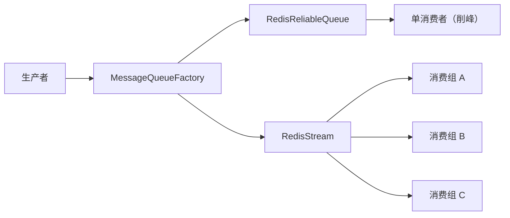
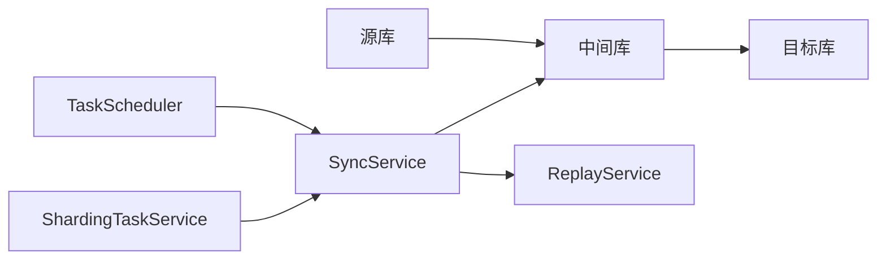

# FastData 技术设计文档

## 1. 总体架构

```
FastData/
├── FastData/                          # 核心 ORM（运行时能力）
│   ├── FastRead.cs / FastWrite.cs     # 静态入口
│   ├── FastDb.cs                      # 数据库上下文切换
│   ├── FastMap.cs                     # XML Map SQL 解析
│   ├── Model/                         # 查询模型（DataQuery/DataQueryT）
│   ├── Sharding/                      # 分表（5 种策略）
│   ├── Queue/                         # 消息队列（FastWrite/FastRead Queue）
│   └── Repository/                    # 分层接口（IRead/IWrite/IMap）
│
├── FastUntility/                      # 通用工具库
│   └── Base/                          # 日志/加密/HTTP/Excel/Cache
│
├── FastRedis/                         # Redis 组件
│   ├── RedisInfo.cs                   # NServiceKit 实现（net45）
│   ├── RedisInfo.NewLife.cs           # NewLife 实现（net6.0+）
│   ├── Repository/                    # Redis 仓储
│   └── Messaging/                     # 消息队列（ReliableQueue/Stream）
│
├── FastData.Tooling/                  # 工具公共库
│   ├── Database/                      # 元数据读取、适配器、方言
│   └── CodeGeneration/                # 代码生成器
│
├── FastData.ModelGenerator.WinForms/  # 代码生成工具（6 Tab）
├── FastData.SyncTool.WinForms/        # 数据同步工具（中间库模式）
├── FastData.Tests/                    # 单元测试（xUnit）
├── FastData.Demo/                     # Web API 示例
└── FastData.Example/                  # 控制台示例
```

## 2. 核心设计决策

### 2.1 多目标框架策略

| 框架 | Redis | 序列化 | 缓存 |
|------|-------|--------|------|
| net45 | NServiceKit.Redis 1.0.17 | JavaScriptSerializer | System.Runtime.Caching |
| net6.0+ | NewLife.Redis 6.0.2024 | System.Text.Json | Microsoft.Extensions.Caching.Memory |

条件编译符号：
- `NETFRAMEWORK` - net45 专用代码
- `NET6_0_OR_GREATER` - net6.0+ 专用代码
- `!NETFRAMEWORK` - 非 net45 代码

### 2.2 项目分离原则

- ORM 核心包不引用 WinForms 依赖
- 工具项目引用核心包
- 工具之间通过 FastData.Tooling 共享能力



### 2.3 FastData.Shared 已废弃

原 `FastData.Shared` 项目仅包含连接管理功能，仅被 ModelGenerator 使用。已合并到 `FastData.ModelGenerator.WinForms/Components/ConnectionManager.cs`，项目已删除。

### 2.4 RestSharp 版本

| 框架 | 版本 | 说明 |
|------|------|------|
| net452 | 106.11.7 | .NET Framework 兼容 |
| net6.0+ | 108.0.0 | 现代化 API |

---

## 3. 关键组件设计

### 3.1 Repository 分层接口

```csharp
public interface IReadRepository
{
    List<T> Query<T>(Expression<Func<T, bool>> predicate);
    PaginationResult ToPagination<T>(PaginationRequest request);
}

public interface IWriteRepository
{
    WriteReturn Add<T>(T entity);
    WriteReturn AddList<T>(IList<T> list);
    WriteReturn Update<T>(T entity, Expression<Func<T, bool>> predicate);
    WriteReturn Delete<T>(Expression<Func<T, bool>> predicate);
}

public interface IMapRepository
{
    List<T> Query<T>(string mapId, SqlParameter[] parameters);
}

public interface IFastRepository : IReadRepository, IWriteRepository, IMapRepository { }
```

### 3.2 消息队列架构



### 3.3 分表策略

| 策略 | 适用场景 | 核心逻辑 |
|------|---------|---------|
| Time | 日志、订单 | 按时间粒度（日/周/月/季/年）创建分表 |
| Hash | 用户、订单 | 按字段哈希值分表（支持一致性哈希） |
| List | 状态、地区 | 按枚举值分表 |
| Composite | 多维组合 | 多字段组合分表 |
| QueryFrequency | 冷热分离 | 热数据一张表，冷数据按哈希分表 |

### 3.4 同步工具架构



中间库模式优势：
- 解耦源库和目标库
- 支持断点续传
- 失败记录可恢复
- 支持数据检查

---

## 4. 技术栈

| 组件 | 技术 | 版本 |
|------|------|------|
| 运行环境 | .NET Framework / .NET 6/8/10 | 多框架 |
| UI 框架 | WinForms | .NET Framework / .NET 6+ |
| 测试框架 | xUnit | 2.9.2 |
| 构建工具 | dotnet CLI / MSBuild | .NET SDK 10.0 |
| Redis 客户端 | NewLife.Redis / NServiceKit.Redis | 6.0.2024 / 1.0.17 |
| HTTP 客户端 | RestSharp | 106.11.7 / 108.0.0 |
| JSON | Newtonsoft.Json / System.Text.Json | 13.0.3 / 8.0.0 |

---

**最后更新**: 2026-05-29
