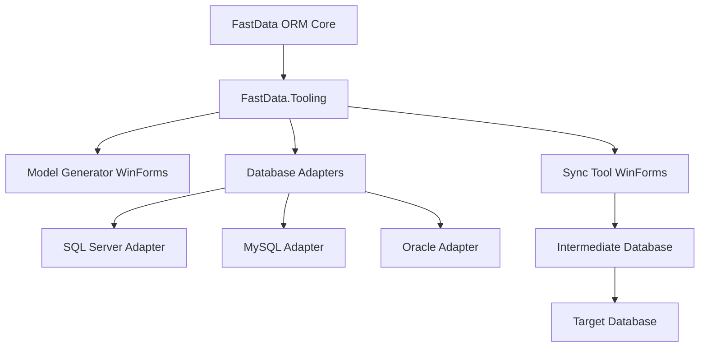
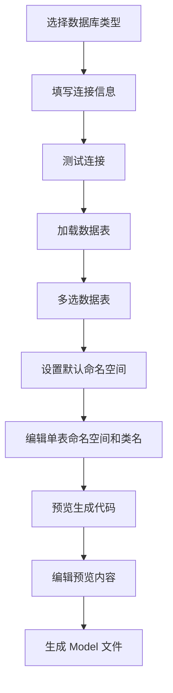
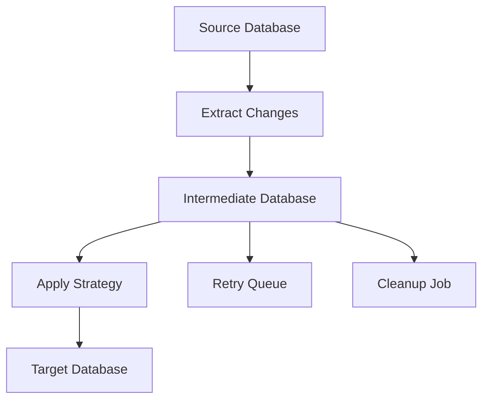

# 项目需求2026年5月 - 技术方案

## 1. 总体方案

本期建设围绕 FastData ORM 核心库和两个 WinForms 工具展开：

1. FastData.Core 能力增强：抽取数据库适配器、元数据读取、SQL 方言、配置解析等公共能力。
2. FastData.ModelGenerator：WinForms Model 生成工具。
3. FastData.SyncTool：WinForms 数据库同步工具。
4. 中文文档：提供框架与工具完整使用说明。

建议在解决方案中新增两个工具项目和一个可复用基础项目：

1. `FastData.Tooling`：工具公共库，封装数据库适配、元数据、模板、脚本生成、日志等能力。
2. `FastData.ModelGenerator.WinForms`：Model 生成工具界面项目。
3. `FastData.SyncTool.WinForms`：数据库同步工具界面项目。

## 2. 架构设计



### 2.1 分层

1. UI 层：WinForms 界面、任务配置、状态展示、日志查看。
2. Application 层：Model 生成流程、同步任务编排、配置保存、导入导出。
3. Domain 层：数据库元数据、代码生成模型、同步任务、同步策略、清理策略。
4. Infrastructure 层：ADO.NET 访问、FastData ORM 访问、SQL 方言、文件系统、日志。

### 2.2 关键接口

```csharp
public interface IDatabaseAdapter
{
    string ProviderName { get; }
    bool TestConnection(DatabaseConnectionOptions options);
    IDatabaseMetadataReader CreateMetadataReader(DatabaseConnectionOptions options);
    ISqlDialect CreateDialect();
}

public interface IDatabaseMetadataReader
{
    IList<DatabaseTable> GetTables();
    IList<DatabaseColumn> GetColumns(string tableName);
}

public interface IModelCodeGenerator
{
    GeneratedModelFile Generate(ModelGenerationRequest request);
}

public interface IIntermediateSchemaBuilder
{
    string GenerateCreateScript(IntermediateSchemaOptions options);
    void CreateSchema(IntermediateSchemaOptions options);
}

public interface ISyncStrategy
{
    SyncBatch PullToIntermediate(SyncTaskContext context);
    SyncResult PushToTarget(SyncTaskContext context, SyncBatch batch);
}

public interface IIntermediateCleanupStrategy
{
    CleanupResult Cleanup(CleanupContext context);
}
```

## 3. Model 生成工具方案

### 3.1 操作流程



### 3.2 界面模块

1. 数据库连接页：数据库类型、连接字符串、连接测试、历史连接。
2. 表选择页：表列表、多选、搜索、字段预览。
3. 生成配置页：默认命名空间、输出目录、命名规则、特性开关、覆盖策略。
4. 代码预览页：按表展示生成代码，支持编辑。
5. 生成结果页：成功文件、失败文件、错误原因。

### 3.3 生成规则

1. 表名转换为类名，默认支持 PascalCase。
2. 字段名转换为属性名，默认支持 PascalCase。
3. 数据库类型映射为 C# 类型。
4. 可空字段生成 nullable 类型。
5. 支持生成 `[Table]` 和 `[Column]` 特性。
6. 支持每张表独立命名空间。

### 3.4 可编辑实现

生成器先生成内存对象 `GeneratedModelFile`，UI 将内容绑定到文本编辑控件。用户编辑后的内容作为最终写入内容，避免二次生成覆盖用户修改。

## 4. 数据库同步工具方案

### 4.1 核心设计

数据同步采用中间库模式。源库数据先进入中间库，中间库记录同步状态、批次、重试次数、错误信息和目标写入状态。目标库消费中间库数据并写入业务表。



### 4.2 中间库表设计

建议中间库包含以下表：

1. `fd_sync_task`：同步任务定义。
2. `fd_sync_table_map`：源表与目标表映射。
3. `fd_sync_batch`：同步批次。
4. `fd_sync_record`：同步记录与数据载荷。
5. `fd_sync_error`：同步错误。
6. `fd_sync_checkpoint`：增量同步检查点。
7. `fd_sync_log`：运行日志。

### 4.3 中间库 SQL 导出

每种数据库提供独立脚本生成器：

1. `SqlServerIntermediateSchemaBuilder`。
2. `MySqlIntermediateSchemaBuilder`。
3. `OracleIntermediateSchemaBuilder`。

工具创建中间库时先调用脚本生成器生成 SQL，再尝试自动执行。执行失败时将同一份 SQL 提供给用户导出，确保自动和手动建库口径一致。

### 4.4 同步策略

#### 4.4.1 全量同步

适合首次同步或小表同步。流程为分页读取源表数据，写入中间库批次，再按批次写入目标库。

#### 4.4.2 增量同步

适合有更新时间字段、自增主键或业务流水号的表。通过 `fd_sync_checkpoint` 保存上次同步位置。

#### 4.4.3 定时同步

适合实时性要求较低的场景。通过定时器按配置周期执行。

#### 4.4.4 近实时同步

适合实时性要求较高的场景。采用短间隔轮询、批量处理和快速失败重试。后续可扩展数据库 CDC 或触发器方案。

### 4.5 冲突处理策略

1. InsertOnly：仅插入新数据。
2. Upsert：存在则更新，缺失则插入。
3. Replace：目标数据整体覆盖。
4. SkipExisting：目标存在时跳过。
5. Custom：通过扩展接口实现自定义处理。

### 4.6 可靠性设计

1. 每条同步记录保留状态：Pending、Processing、Success、Failed、DeadLetter。
2. Processing 状态设置超时时间，工具重启后可恢复为 Pending。
3. 每条失败记录保存错误消息、异常堆栈、重试次数和最后重试时间。
4. 同步任务按批次提交，减少单次事务过大带来的风险。
5. 目标库写入操作应支持幂等策略。

### 4.7 中间库清理策略

1. 按时间清理：清理超过保留天数且状态为 Success 的记录。
2. 按容量清理：当中间库记录数或磁盘占用超过阈值时，优先清理最早的 Success 数据。
3. 按批次清理：整批成功后按批次归档或清理。
4. 失败数据保护：Failed 和 DeadLetter 数据按单独保留策略处理。
5. 清理审计：每次清理写入 `fd_sync_log`。

### 4.8 实时性方案

1. 源库到中间库采用可配置轮询间隔，默认短间隔运行。
2. 中间库到目标库采用独立消费线程或定时任务。
3. 批量大小可配置，在延迟和吞吐之间平衡。
4. 对热点表支持更短轮询间隔。
5. 对失败数据使用延迟重试，避免阻塞正常数据。

## 5. 多数据库配置简化方案

### 5.1 统一配置模型

新增统一连接配置模型，减少现有 XML 中按数据库类型重复配置的问题。

```csharp
public class FastDataConnectionConfig
{
    public string Key { get; set; }
    public string Provider { get; set; }
    public string ConnectionString { get; set; }
    public bool IsDefault { get; set; }
    public string DesignModel { get; set; }
    public string CacheType { get; set; }
    public string SqlErrorType { get; set; }
    public bool IsOutSql { get; set; }
    public bool IsOutError { get; set; }
}
```

### 5.2 配置示例

```xml
<DataConfig>
  <Connections>
    <Add Key="DefaultDb" Provider="SqlServer" ConnStr="..." IsDefault="true" DesignModel="DbFirst" CacheType="web" SqlErrorType="file" />
    <Add Key="ReportDb" Provider="MySql" ConnStr="..." DesignModel="DbFirst" CacheType="redis" SqlErrorType="db" />
  </Connections>
</DataConfig>
```

### 5.3 兼容策略

保留现有 Oracle、MySQL、SqlServer 节点解析逻辑，同时优先支持新的 `Connections` 节点。内部统一转换为 `ConfigModel`，降低后续代码复杂度。

## 6. 架构优化计划

### 6.1 数据库能力抽象

抽取数据库提供者、SQL 方言、参数构造、元数据读取能力，减少 Oracle、MySQL、SQL Server 的重复判断。

### 6.2 公共工具库

将 Model 生成和同步工具共用的连接测试、元数据读取、类型映射、日志、配置保存放入 `FastData.Tooling`。

### 6.3 包体积优化

1. 工具项目与 ORM 核心库分离发布。
2. 数据库特定工具逻辑放入独立适配器。
3. 避免 WinForms 工具依赖进入核心 ORM 包。

### 6.4 健壮性优化

1. 统一异常模型。
2. 统一日志接口。
3. 数据库操作增加超时与重试配置。
4. 关键任务状态持久化。

## 7. 中文文档计划

建议新增 `docs/zh-cn/` 目录，包含：

1. `quick-start.md`：快速开始。
2. `configuration.md`：数据库配置。
3. `model-generator.md`：Model 生成工具。
4. `sync-tool.md`：数据库同步工具。
5. `xml-sql-map.md`：XML SQL Map。
6. `repository.md`：Repository 使用。
7. `aop.md`：AOP 使用。
8. `faq.md`：常见问题。

## 8. 实施计划

### 第一阶段：基础抽象

1. 新增 `FastData.Tooling` 项目。
2. 抽取 `IDatabaseAdapter`、`IDatabaseMetadataReader`、`ISqlDialect`。
3. 实现 SQL Server、MySQL、Oracle 基础适配器。
4. 提供统一配置模型。

### 第二阶段：Model 生成工具

1. 新增 WinForms 项目。
2. 实现数据库连接、表加载、多表选择。
3. 实现命名空间配置、单表编辑、代码预览。
4. 实现 Model 文件生成。

### 第三阶段：数据同步工具

1. 新增 WinForms 项目。
2. 实现源库、中间库、目标库配置。
3. 实现中间库脚本生成和导出。
4. 实现全量同步、增量同步、重试和状态记录。
5. 实现中间库清理策略。

### 第四阶段：文档与验收

1. 编写中文使用文档。
2. 补充示例配置和示例截图说明。
3. 执行端到端验证。
4. 整理发布说明。

## 9. 风险与应对

1. 数据库方言差异：通过 `ISqlDialect` 和脚本生成器隔离差异。
2. 大数据同步性能：采用分页、批次、检查点和容量清理策略。
3. 同步一致性风险：通过中间库状态机、幂等写入和重试机制降低风险。
4. WinForms 工具复杂度：通过 Application 层封装业务流程，保持 UI 层简单。
5. 包体积增加：工具项目与 ORM 核心包分离。
