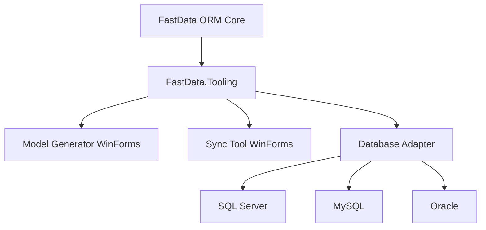
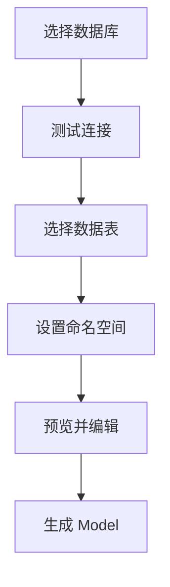
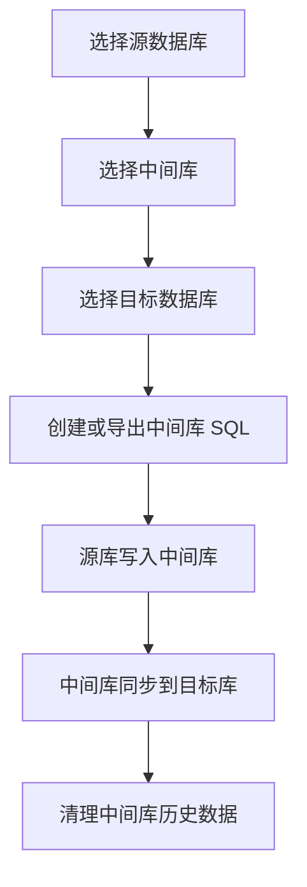

# 项目需求2026年5月 - 技术方案

## 1. 方案核对

原始需求包含 5 个方向：架构优化、Model 生成工具、多数据库配置简化、中文文档、数据同步工具。

当前技术方案按这 5 个方向组织，删除过细的界面与状态机展开，只保留实现所需的核心设计和验收要点。

## 2. 总体架构

建议新增三个项目，保持 ORM 核心轻量：

1. `FastData.Tooling`：工具公共库，提供数据库适配、元数据读取、类型映射、脚本生成和日志能力。
2. `FastData.ModelGenerator.WinForms`：Model 生成工具。
3. `FastData.SyncTool.WinForms`：数据同步工具。

核心库 `FastData` 继续负责 ORM 运行时能力，工具项目引用核心库，核心库不引用工具项目。



## 3. 架构优化方案

### 3.1 现状问题

当前数据库差异逻辑主要分布在：

1. `DataConfig.cs`：不同数据库配置解析重复。
2. `BaseExecute.cs`：分页、执行和参数处理存在数据库分支。
3. `BaseModel.cs`：增删改 SQL 与主键查询存在数据库分支。
4. `BaseField.cs`、`VisitExpression.cs`：字段包装和参数占位符存在方言差异。
5. `MapXml.cs`、`DbLogTable.cs`：Map 文件和日志表模型按数据库类型选择。

### 3.2 抽象方向

新增以下抽象：

```csharp
public interface IDatabaseAdapter
{
    string Name { get; }
    string ProviderName { get; }
    string ParameterPrefix { get; }
    ISqlDialect Dialect { get; }
    IDatabaseMetadataReader CreateMetadataReader(string connectionString);
}

public interface ISqlDialect
{
    string QuoteName(string name);
    string BuildPageSql(string sql, int pageIndex, int pageSize);
    string BuildPrimaryKeySql(string tableName);
}

public interface IDatabaseMetadataReader
{
    IList<DatabaseTable> GetTables();
    IList<DatabaseColumn> GetColumns(string tableName);
}
```

优先迁移顺序：配置解析、SQL 方言、元数据读取、日志与 Map 文件持久化。

## 4. 多数据库配置与优雅切换

### 4.1 简化配置

新增统一 `Connections` 配置，保留旧格式兼容读取。

```xml
<DataConfig Default="DefaultDb">
  <Connections>
    <Add Key="DefaultDb" Provider="SqlServer" ConnStr="..." DesignModel="DbFirst" />
    <Add Key="ReportDb" Provider="MySql" ConnStr="..." DesignModel="DbFirst" />
    <Add Key="ArchiveDb" Provider="Oracle" ConnStr="..." DesignModel="DbFirst" />
  </Connections>
</DataConfig>
```

内部统一转换为现有 `ConfigModel`，降低调用层和执行层复杂度。

### 4.2 推荐 API 写法

默认库读取：

```csharp
var users = FastRead.Query<User>(a => a.IsEnabled == true);
```

指定库读取：

```csharp
var reports = FastRead.Use("ReportDb").Query<Report>(a => a.Year == 2026);
```

作用域切换：

```csharp
using (FastDb.Use("ArchiveDb"))
{
    var logs = FastRead.Query<Log>(a => a.CreatedTime >= beginTime);
    FastWrite.Add(new ArchiveLog());
}
```

Repository 注入：

```csharp
public class UserService
{
    private readonly IFastRepository defaultRepository;
    private readonly IFastRepository reportRepository;

    public UserService(IFastRepositoryFactory factory)
    {
        defaultRepository = factory.Default();
        reportRepository = factory.Use("ReportDb");
    }
}
```

### 4.3 实现方式

1. 新增 `FastDb` 保存当前执行上下文的数据库 Key。
2. 新增 `FastRead.Use(key)` 和 `FastWrite.Use(key)`，返回绑定数据库 Key 的轻量调用对象。
3. 新增 `IFastRepositoryFactory`，支持默认库和指定库 Repository。
4. 保留现有 `key` 参数调用方式，作为兼容路径。
5. 配置缺失时输出明确错误信息，提示可用数据库 Key。

## 5. Model 生成工具方案

Model 生成工具使用 WinForms 实现，核心流程：



核心功能：

1. 支持 SQL Server、MySQL、Oracle。
2. 支持表搜索、多选、字段预览。
3. 支持默认命名空间和单表命名空间覆盖。
4. 支持代码预览和编辑。
5. 支持覆盖、跳过和生成结果展示。
6. 通过 `IDatabaseMetadataReader` 扩展数据库类型。

## 6. 数据同步工具方案

数据同步工具使用 WinForms 实现，复用 `FastData.Tooling` 和 FastData ORM 能力。

### 6.1 核心流程



### 6.2 中间库设计

中间库保留同步任务、表映射、批次、记录、检查点、错误和日志。

建议表：

1. `fd_sync_task`：任务定义。
2. `fd_sync_table_map`：表映射。
3. `fd_sync_batch`：同步批次。
4. `fd_sync_record`：同步记录和数据载荷。
5. `fd_sync_checkpoint`：增量同步检查点。
6. `fd_sync_error`：错误记录。
7. `fd_sync_log`：运行日志。

中间库脚本由 `IIntermediateSchemaBuilder` 生成，自动创建失败时导出同一份 SQL 供手动执行。

### 6.3 同步策略

1. 全量同步：分页读取源表，批量写入中间库，再写入目标库。
2. 增量同步：通过更新时间、自增主键或业务流水号记录检查点。
3. 定时同步：按固定周期执行。
4. 近实时同步：短间隔轮询和批量处理。

目标库冲突策略支持 InsertOnly、Upsert、Replace、SkipExisting 和 Custom。

### 6.4 稳定性与实时性

1. 源库到中间库、中间库到目标库分成两个处理循环。
2. 每条同步记录保存 Pending、Processing、Success、Failed、DeadLetter 状态。
3. 失败记录支持重试，超过次数进入 DeadLetter。
4. 工具重启后恢复超时 Processing 数据。
5. 中间库按保留天数、记录数量或批次清理 Success 数据。
6. 界面展示任务状态、积压数量、错误信息和最近同步时间。

## 7. 中文文档计划

新增 `docs/zh-cn/`：

1. `quick-start.md`：快速开始。
2. `configuration.md`：多数据库配置和优雅切换写法。
3. `model-generator.md`：Model 生成工具。
4. `sync-tool.md`：数据同步工具。
5. `xml-sql-map.md`：XML SQL Map。
6. `repository.md`：Repository。
7. `aop.md`：AOP。
8. `faq.md`：常见问题。

## 8. 实施顺序

1. 抽取数据库配置、适配器、SQL 方言和元数据读取接口。
2. 实现统一 `Connections` 配置和优雅多库切换 API。
3. 实现 Model 生成工具。
4. 实现数据同步工具的中间库脚本、全量同步、增量同步、重试和清理。
5. 编写中文文档和示例。

## 9. 验收重点

1. 原有 ORM 调用保持可用。
2. 默认库调用无需传 Key，指定库调用写法清晰。
3. Model 生成工具可生成可编译 Model。
4. 数据同步工具可完成源库到目标库同步，并支持中间库 SQL 导出。
5. 工具项目与 ORM 核心包分离发布。
