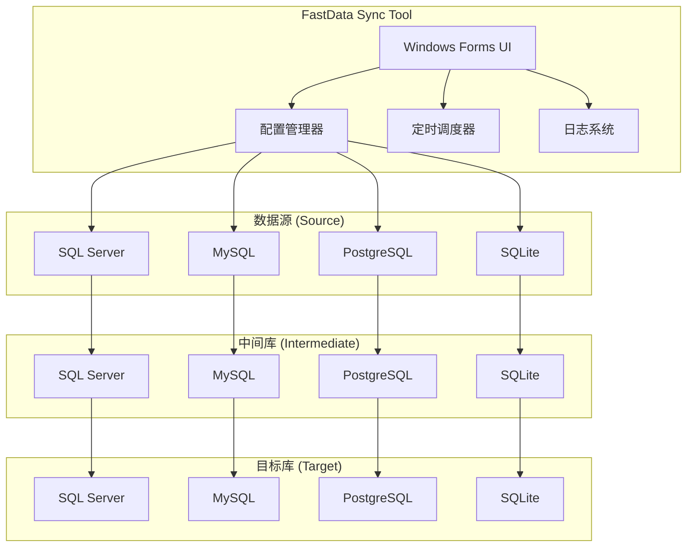
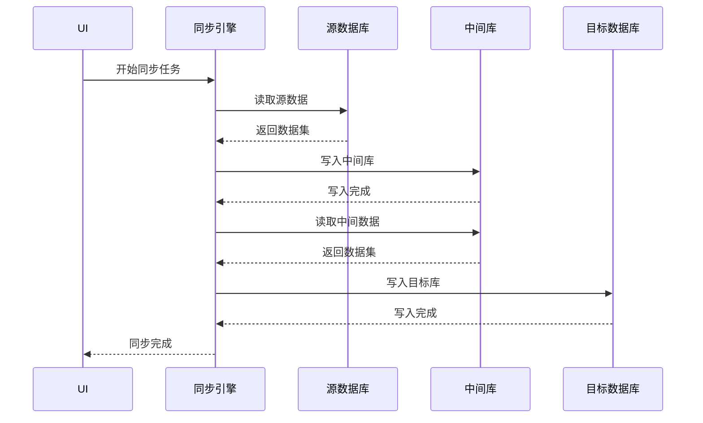
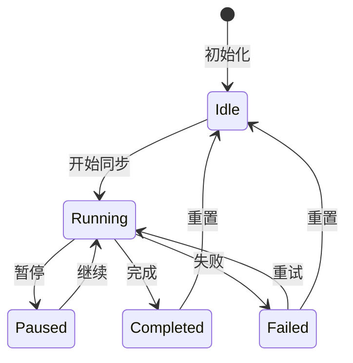
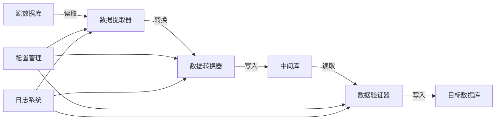
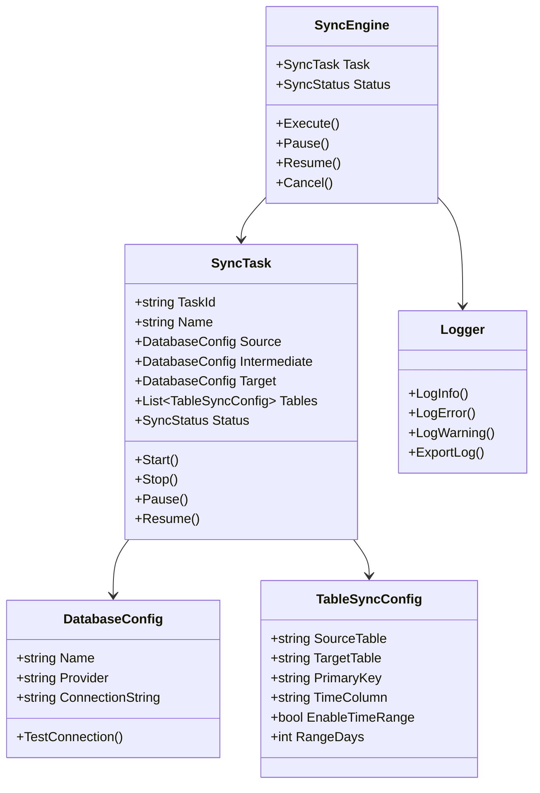
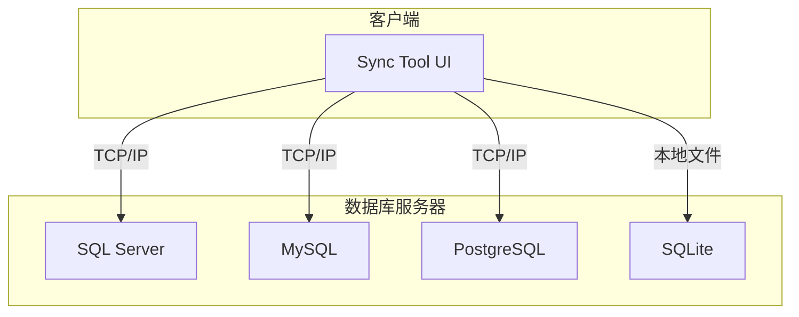

# FastData Sync Tool 架构图

## 整体架构

```mermaid
graph TB
    subgraph "FastData Sync Tool"
        UI[Windows Forms UI]
        Config[配置管理器]
        Scheduler[定时调度器]
        Logger[日志系统]
    end

    subgraph "数据源 (Source)"
        SQL_SERVER_SRC[SQL Server]
        MYSQL_SRC[MySQL]
        PG_SRC[PostgreSQL]
        SQLITE_SRC[SQLite]
    end

    subgraph "中间库 (Intermediate)"
        SQL_SERVER_INT[SQL Server]
        MYSQL_INT[MySQL]
        PG_INT[PostgreSQL]
        SQLITE_INT[SQLite]
    end

    subgraph "目标库 (Target)"
        SQL_SERVER_TGT[SQL Server]
        MYSQL_TGT[MySQL]
        PG_TGT[PostgreSQL]
        SQLITE_TGT[SQLite]
    end

    UI --> Config
    UI --> Scheduler
    UI --> Logger

    Config --> SQL_SERVER_SRC
    Config --> MYSQL_SRC
    Config --> PG_SRC
    Config --> SQLITE_SRC

    SQL_SERVER_SRC --> SQL_SERVER_INT
    MYSQL_SRC --> MYSQL_INT
    PG_SRC --> PG_INT
    SQLITE_SRC --> SQLITE_INT

    SQL_SERVER_INT --> SQL_SERVER_TGT
    MYSQL_INT --> MYSQL_TGT
    PG_INT --> PG_TGT
    SQLITE_INT --> SQLITE_TGT
```

## 同步流程

```mermaid
sequenceDiagram
    participant UI as UI
    participant Sync as 同步引擎
    participant Source as 源数据库
    participant Intermediate as 中间库
    participant Target as 目标数据库

    UI->>Sync: 开始同步任务
    Sync->>Source: 读取源数据
    Source-->>Sync: 返回数据集
    Sync->>Intermediate: 写入中间库
    Intermediate-->>Sync: 写入完成
    Sync->>Intermediate: 读取中间数据
    Intermediate-->>Sync: 返回数据集
    Sync->>Target: 写入目标库
    Target-->>Sync: 写入完成
    Sync-->>UI: 同步完成
```

## 状态管理

```mermaid
stateDiagram-v2
    [*] --> Idle: 初始化
    Idle --> Running: 开始同步
    Running --> Paused: 暂停
    Paused --> Running: 继续
    Running --> Completed: 完成
    Running --> Failed: 失败
    Failed --> Running: 重试
    Completed --> Idle: 重置
    Failed --> Idle: 重置
```

## 数据流向

```mermaid
flowchart LR
    A[源数据库] -->|读取| B[数据提取器]
    B -->|转换| C[数据转换器]
    C -->|写入| D[中间库]
    D -->|读取| E[数据验证器]
    E -->|写入| F[目标数据库]
    
    G[配置管理] --> B
    G --> C
    G --> E
    
    H[日志系统] --> B
    H --> C
    H --> E
```

## 组件关系

```mermaid
classDiagram
    class SyncTask {
        +string TaskId
        +string Name
        +DatabaseConfig Source
        +DatabaseConfig Intermediate
        +DatabaseConfig Target
        +List~TableSyncConfig~ Tables
        +SyncStatus Status
        +Start()
        +Stop()
        +Pause()
        +Resume()
    }

    class DatabaseConfig {
        +string Name
        +string Provider
        +string ConnectionString
        +TestConnection()
    }

    class TableSyncConfig {
        +string SourceTable
        +string TargetTable
        +string PrimaryKey
        +string TimeColumn
        +bool EnableTimeRange
        +int RangeDays
    }

    class SyncEngine {
        +SyncTask Task
        +SyncStatus Status
        +Execute()
        +Pause()
        +Resume()
        +Cancel()
    }

    class Logger {
        +LogInfo()
        +LogError()
        +LogWarning()
        +ExportLog()
    }

    SyncTask --> DatabaseConfig
    SyncTask --> TableSyncConfig
    SyncEngine --> SyncTask
    SyncEngine --> Logger
```

## 部署架构

```mermaid
graph TB
    subgraph "客户端"
        Client[Sync Tool UI]
    end

    subgraph "数据库服务器"
        DB1[SQL Server]
        DB2[MySQL]
        DB3[PostgreSQL]
        DB4[SQLite]
    end

    Client -->|TCP/IP| DB1
    Client -->|TCP/IP| DB2
    Client -->|TCP/IP| DB3
    Client -->|本地文件| DB4
```
